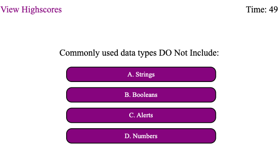

# Challenge-4-Coding-Quiz-Challenge

## Description

This repository contains the code for the coding quiz challenge. The purpose of this webpage is to test the users knowledge on basic JavaScript knowledge. The user's knowledge is critiqued using a 60 second timer. The score is dependent on how much time the user spends correctly answering 5 multiple choice questions. Selecting a wrong asnwer will penalize the user by 5 seconds. After finishing the quiz the user can then document their score on the scoreboard and compare with their peers. 

## Installation

Use the URL: https://fardinatabassum.github.io/Challenge-4-Coding-Quiz-Challenge/

## Usage

The assets file contains css used to style the password generator as wel as the javascript used to make the intercative quiz. The images folder contains a screenshot of the finished quiz challenge webpage.

Opening the index.html file or by clicking the provided URL leads the user to the quiz webpage. Users may start the quiz by clicking on the start button. Starting the quiz will also simultaneously start the timer which will start counting down for 60 seconds. The user is given 4 opotions to choose the correct answer from. Clicking each option will alert the user whether they have selected the right or wrong answer. After answering the 5 questions the quiz will end and the user can then enter their intials to save their score. Selecting the view high scores button will allow users to see all previous attempts and scores.

## License

Uses the MIT License
# 